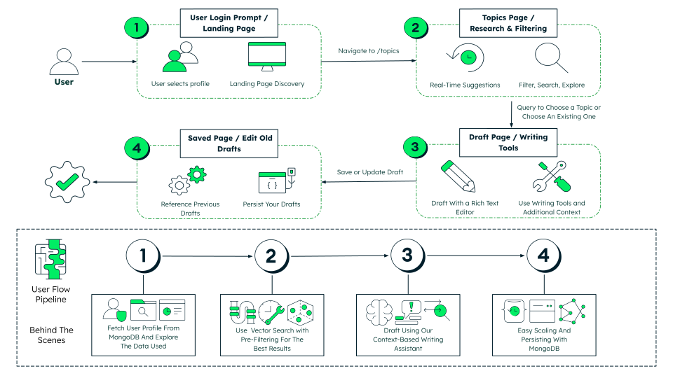
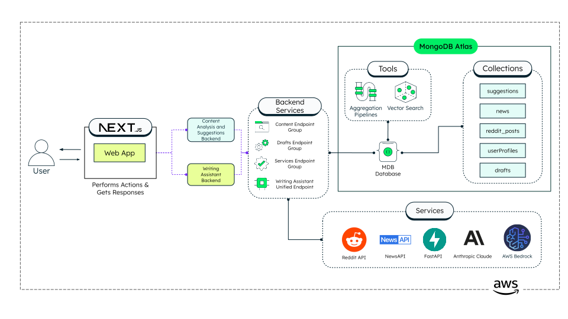
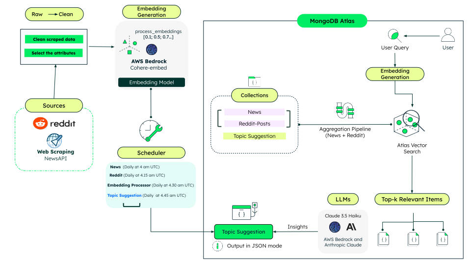
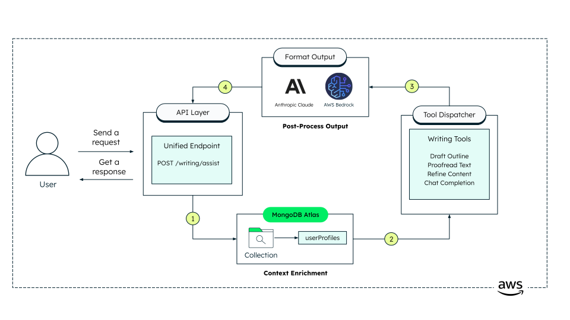

# The Content Lab

**The Content Lab is the graphical user interface (GUI) for our demo content creation platform**, showcasing the integration of MongoDB's powerful features tailored specifically for the Media Industry. This responsive and intuitive UI allows users to interact with a fully functional demo content management environment, highlighting advanced capabilities like real-time content aggregation, AI-powered writing assistance, and a seamless editorial experience. It is designed to demonstrate the potential of building modern, journalist-focused content applications with MongoDB as the backbone.

## Components and Features:

The Content Lab is composed of several interconnected features that demonstrate the capabilities of modern content management systems. The following diagram illustrates the complete user journey from login to draft completion:



Users can:

1. **Select a Demo User**
   - Choose from a range of pre-loaded demo personas.
   - Each user has unique writing styles, preferences, and AI assistant personalities.
   - Designed to create a dynamic, realistic experience for different content creation approaches.

2. **Explore Trending Content**
   - View curated news articles and viral social media posts.
   - Access real-time content aggregation from multiple sources.
   - Browse categorized content across topics like technology, business, sports and more.

3. **Research Content Topics**
   - Discover trending topics and content suggestions.
   - Access topic-specific research data and background information.
   - Generate content ideas based on current trends.

4. **Create and Edit Drafts**
   - Use a rich text editor for professional content creation.
   - Save drafts manually with metadata including title, category, and keywords.
   - Edit existing drafts with full formatting capabilities and content persistence.

5. **Interact with AI Writing Assistant**
   - Chat with persona-specific AI assistants for writing guidance.
   - Receive contextual suggestions based on current draft content.
   - Get style recommendations tailored to the selected user persona.

6. **Switch Between Demo Users**
   - Seamlessly switch between different content creator personas.
   - Experience how writing styles and AI assistance adapt to different user types.
   - Validate and test how content creation workflows behave across different user contexts.

## Where Does MongoDB Shine?

The Content Lab demonstrates the power and flexibility of MongoDB, making it an ideal choice for modern content management and media applications. By leveraging MongoDB's advanced features, the backend services are designed to handle complex content operations efficiently and securely.

This modern **microservices architecture** splits functionalities across different repositories, showcasing a real-world approach to scalable and maintainable software development. Here's how MongoDB shines in the backend services powering The Content Lab:



### 1. **Content Analysis & Suggestion Engine**  
**Repository:** [Content Lab – Automated Content Analysis & Suggestion Engine](https://github.com/mongodb-industry-solutions/ist-media-internship-be)

This FastAPI‑based service powers the backend for content insights by ingesting, storing, and analyzing news and social media data, as well as managing user drafts:

- **Collection Fetch**  
  Retrieves raw and processed documents (news articles, social media posts, topic suggestions, user profiles) directly from MongoDB for the frontend UI.

- **Drafts Management**  
  Handles creation, retrieval, updating, and deletion of draft documents, each containing metadata (title, category, keywords) and rich‑text content.

- **‘suggestions’ Collection**  
  Maintains generated topic suggestions with metadata (timestamp, source, content, etc.). Continuously refreshed by scheduled jobs to surface the latest trends.

- **Automated Content Aggregation**  
  Periodically ingests data from external news and social media APIs, normalizes payloads into MongoDB, and runs aggregation pipelines to extract and rank emerging topics.

- **Semantic Research**  
  Accepts a topic as input and returns curated links and resources from external indexes to support deep exploration of each trend.

- **Content Analysis**  
  Performs semantic searches over news and social media collections to derive new topic suggestions and deliver contextually relevant source documents.



---

### 2. **AI Chatbot Service**  
**Repository:** [Content Lab – AI Chatbot Service](https://github.com/mongodb-industry-solutions/ist-media-internship-be2)

A single FastAPI endpoint powers all conversational and writing‑tool operations:

- **Unified Chat Endpoint** 
  - Accepts the full context payload: current draft content, user profile, selected topic, and tool‑type hint (chat completion vs. writing tool).  
  - Internally routes the request to the appropriate sub‑routine based on payload flags.

- **Context Enrichment**   
  - Ensures every reply is tailored to the user’s style, current draft state, and topic.

- **AI Invocation**  
  - Delegates to an LLM for both free‑form chat and structured writing tasks, then returns the enhanced text or suggestions to the frontend in real time.
  


---

By adopting a **microservices architecture**, The Content Lab splits features across multiple repositories. This design not only supports **scalability**, **modular development**, and **independent deployments** but also underscores MongoDB's versatility in driving dynamic and robust content management systems.

This approach reflects a **modern and practical way to develop software**, supporting the scalability, modularity, and maintainability required for media and publishing applications in today's fast-evolving digital landscape.

## Tech Stack

The Content Lab is built with a modern tech stack designed to deliver a responsive and dynamic content creation experience. Here's an overview of the primary technologies used:

- **Web Framework:**
  - [Next.js 15](https://nextjs.org/) with App Router

- **Frontend Library:**
  - [React 19 RC](https://react.dev/)

- **Styling:**
  - [CSS Modules](https://github.com/css-modules/css-modules) for component styling
  - [LeafyGreen Design System](https://www.mongodb.design/)

- **UI Components:**
  - [LeafyGreen UI](https://github.com/mongodb/leafygreen-ui) for customizable components
  - [Lucide React](https://lucide.dev/) for extra icons

- **Animations and Effects:**
  - Open-source components from [Magic UI](https://magicui.design/), [React Bits](https://reactbits.dev/) and [21st.dev](https://21st.dev/home)

- **Core React and Next.js:**
  - `next`, `react`, `react-dom`

This tech stack ensures The Content Lab is both powerful and user-friendly, capable of handling the interactive needs of modern content creation applications.

## Further Reading

For a detailed breakdown of folder structure, component/data-flow and design patterns used in this project, see [ARCHITECTURE.md](./ARCHITECTURE.md).

## Prerequisites

To run The Content Lab locally, ensure the following prerequisites are met.

### Add environment variables

> **_Note:_** Create a `.env.local` file within the `/src` directory.

```bash
NEXT_PUBLIC_BACKEND_URL="http://localhost:8000"
NEXT_PUBLIC_CHAT_BACKEND_URL="http://localhost:8001"
```

### Backend Services

The UI depends on multiple backend services, which must be running to enable full functionality. It is recommended to configure these services to run on their respective ports:

- **Main Backend Service** (Port **8000**)
  - *Handles news aggregation, draft management, content research, and user profiles. Essential for core functionality.*
- **Chat/AI Backend Service** (Port **8001**)
  - *Manages AI writing assistant interactions and contextual content suggestions. Essential for AI-powered features.*

### Node.js Requirements
- **Node.js 14 or higher**

These prerequisites are essential for creating a complete and realistic demo environment for The Content Lab. Ensure all services are running and correctly configured to enable smooth interaction across the application.

## Run it Locally

> **Note**: Once you have the backend services running, you can start The Content Lab locally. Follow these steps to run the UI on your machine:

### Run on Local Machine

1. Navigate to the `/src` folder.
2. Install dependencies by running:
```bash
npm install
```
3. Start the frontend development server with:
```bash
npm run dev
```
4. The frontend will now be accessible at http://localhost:3000 by default, providing a user interface.

## Run with Docker

Make sure to run this on the root directory.

1. To run with Docker use the following command:
```
make build
```
2. To delete the container and image run:
```
make clean
```

## Common Errors & Troubleshooting

- Check that you've created an `.env.local` file that contains the required environment variables.
- Required environment variables:
  - `NEXT_PUBLIC_BACKEND_URL`: Main backend service URL (defaults to http://localhost:8000)
  - `NEXT_PUBLIC_CHAT_BACKEND_URL`: Chat/AI backend service URL (defaults to http://localhost:8001)
- If experiencing build issues with peer dependencies, try installing with `npm install --legacy-peer-deps`
